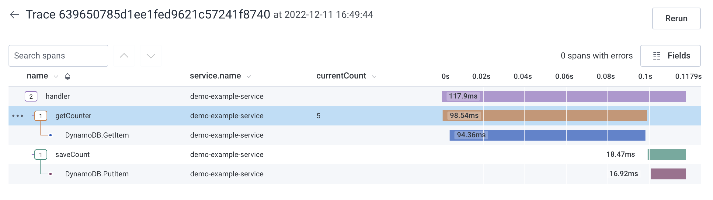

# Cdk lambda Typescript OTEL Honeycomb

[Blog post explaining this project](https://dalejsalter.com/post/8afd46ad-7da2-4b2a-9cb5-9e5ae4fe6cc2)

**Purpose:**

This project is meant to demonstrate how to export (automatic + manual) traces from lambda to honeycomb. The reason we cannot just use standard library (@opentelemetry/api) / exporter (and why we must use a layer) is because lambda does not flush the traces after an invoke. This will lead to missing telemetry data.

**Why does this demo project exist?**

Getting AWS' Lambda layer to work CDK + Honeycomb is hard.
1. CDK uses ESbuild -- OTel's auto-instrumentation requires certain values be modifiable / be layed out a particular way
1. The [aws-otel-lambda](https://github.com/aws-observability/aws-otel-lambda) works best with XRay
1. [Honeycomb](https://docs.honeycomb.io/getting-data-in/aws/aws-lambda/) recommends aws-otel-lambda, but does not provide a detailed guide on how to set it up

**Set-up demo project**

1. Copy + Paste `collector-template.yaml` to `collector.yaml`
1. Replace `xxx` in `collector.yaml` to your honeycomb keys
1. `npm install` -- Installs dependencies
1. `npx cdk deploy` -- Deploys the stack NOTE: Must use us-east-1 as this is where the lambda layer is
1. Hit the URL that CDK outputs from the deployment. You should see a counter
1. Review honeycomb, your traces should be present

**How to use this demo**

This demo project is a reference for the simplest possible set up. Review the /lib directory for changes you will need to make to your application.

**Additional benefits to the project**

- Provides a TYPED decorator style function (spanify) to reduce nesting from `startActiveSpan`
    - Spanify provides a sane default exception handling
- Adds TS typing back to the `@opentelemetry/api` methods

**Todo improvements to the project**

- Push traces to honeycomb when lambda code is run locally (this will require a different codepath that calls a local version of `@opentelemetry/api`)
- Remove us-east-1 from the layer and pull the region from CDK
